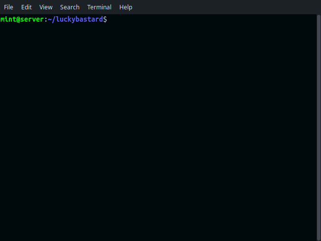

# LuckyBastard



**Are You Lucky Bastard ???**

Generate random hex seeds to find out!

# How to install

Clone Git Repository and install required gems if not installed:

```ruby
 git clone https://github.com/decentralizuj/luckybastard.git
 cd luckybastard

 # install gems if not installed
 gem install money-tree colorize
```

# How to run

Run script with `--start` to start random seed generation.
Default check is by received, you can run with `--sent` to
check for received coins by address.

```ruby
 ruby luckybastard.rb --start

 ruby luckybastard.rb --start --sent
```
